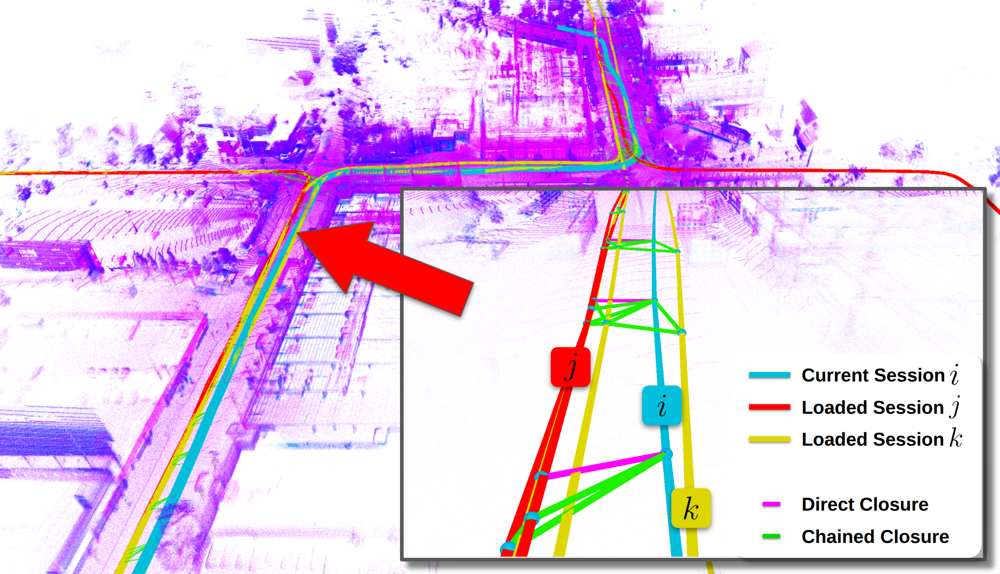
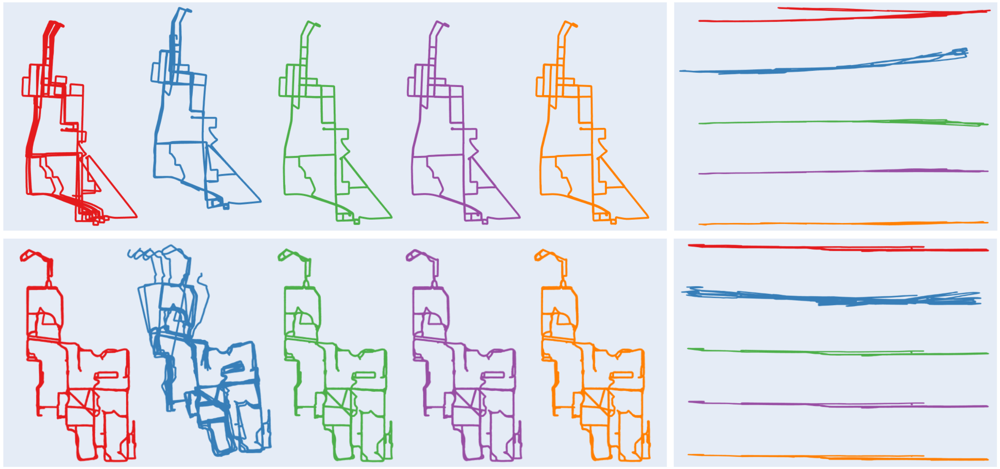

# [IROS 2026] Chain-SLAM: Globally Consistent Backend for Multi-Session LiDAR SLAM via Chained Loop Closure

[Zhiheng Li](.), [Xinhao Liu](.), [Juexiao Zhang](.), [Yongqing Liang](.), [Chen Feng](.)

New York University

### TL;DR: Chain-SLAM is a real-time LiDAR–inertial SLAM backend for online multi-session map alignment and reuse, propagating loop-closure constraints across sessions via *chained loop closure* for globally consistent large-scale mapping.

Evaluated on the multi-session **[MARS](https://example.com/dataset/mars)** and **[NCLT](https://example.com/dataset/nclt)** datasets · pre-converted ROS bags [here](https://example.com/chain-slam/rosbags). <!-- TODO: replace with real links -->



*Direct and **chained** loop closures between a current session `i` and loaded
sessions `j`, `k`. Each successful closure from the current session triggers
multiple chained closures to the loaded sessions, enhancing multi-session
consistency.*

---

## Results



Estimated trajectories across multiple sessions (top vs. bottom rows) overlaid per
session, with the per-session alignment error against ground truth shown on the
right.

---

# Getting Started

## 1. Build the Docker environment

The [`docker/`](docker/) directory provides a reproducible ROS Noetic environment.
The image bakes in the system dependencies and GTSAM; the workspace and Open3D are
built once inside the container. See [docker/README.md](docker/README.md) for details.

```bash
# On the host, from the repo root:

# 1. Build the image (apt deps + GTSAM from source)
docker build -t chainslam_ros1:latest docker/

# 2. Create & enter the container (re-run this later to re-enter it)
./docker/run.sh

# --- inside the container ---

# 3. Build Open3D 0.15.1 from source (once)
./docker/install_open3d.sh

# 4. Build the catkin workspace (clones livox_ros_driver, then catkin_make)
./docker/build_ws.sh

# 5. Source the overlay
source devel/setup.bash
```

The repo is bind-mounted at the same path inside the container as on the host, so
launch-file and pipeline paths resolve identically. `run.sh` enables GUI (rviz)
access, optional NVIDIA GPU passthrough, and mounts `/home`, `/mnt`, and `/media`
for rosbags and outputs.

After code changes, re-run `./docker/build_ws.sh` (or `catkin_make`) inside the
container and re-`source devel/setup.bash`.

> If a crash fills the host disk with core dumps: `sudo rm -rf /var/lib/apport/coredump/*`

---

## 2. Run the mapping pipeline

The pipeline consumes one ROS bag per scene (Velodyne-format point clouds, plus
IMU/GPS topics). Prepare these bags from your dataset beforehand.

Mapping uses **three terminals**, each running a shell inside the same container.
The key idea is **chaining**: each scene loads the map produced by the previous
scene(s), so poses are optimized against the accumulated map. To map a scene
standalone, skip the `/load_map` step (Terminal 2).

### Entering the container (per terminal)

`./docker/run.sh` enables GUI (rviz) access on the host and `docker exec`s a new
shell into the already-running `chainslam_ros1` container — so run it once in
**each** of the three host terminals. Inside every shell, source ROS and the
workspace overlay before running ROS commands:

```bash
# On the host, from the repo root, in a fresh terminal:
./docker/run.sh

# --- now inside the container ---
source /opt/ros/noetic/setup.bash
source devel/setup.bash
```

> If rviz fails to open with a display error, run `xhost +local:docker` on the
> host once, then re-enter the container. (`run.sh` already attempts this.)

### Terminal 1 — launch mapping (opens rviz)

`log_subfolder` names the output folder under `Log/`. `mode` selects the config
(`full_raw` | `optimize_pose` | `optimize_z`).

```bash
./docker/run.sh                            # enter the container
source /opt/ros/noetic/setup.bash
source devel/setup.bash
roslaunch fast_lio_sam mapping_velodyne128_mars.launch log_subfolder:="scene_0"
```

### Terminal 2 — (optional) load a prior map to chain onto

```bash
./docker/run.sh                            # enter the container
source /opt/ros/noetic/setup.bash
source devel/setup.bash
rosservice call /load_map "source: '/Documents/.../output/scene_prev'"
```

### Terminal 3 — replay the bag

```bash
./docker/run.sh                            # enter the container
source /opt/ros/noetic/setup.bash
source devel/setup.bash
rosbag play scene_0.bag
```

### After playback finishes

In any container shell, save the optimized pose and map (create the destination
directory first — the service does not create it):

```bash
mkdir -p /Documents/.../output/scene_0

rosservice call /save_pose "resolution: 0.0
destination: '/Documents/.../output/scene_0'"

rosservice call /save_map "resolution: 0.0
destination: '/Documents/.../output/scene_0'"
```

### Chaining multiple scenes

To build a single map across scenes 0→1→2→3→4, run the loop above per scene,
loading the previous scene's output as the map and saving to a cumulative folder:

| Scene | `log_subfolder` / save dir | `/load_map` source |
|-------|----------------------------|--------------------|
| 0     | `scene_0`                  | *(none)*           |
| 1     | `scene_0+1`                | `scene_0`          |
| 2     | `scene_0+1+2`              | `scene_0+1`        |
| 3     | `scene_0+1+2+3`            | `scene_0+1+2`      |
| 4     | `scene_0+1+2+3+4`          | `scene_0+1+2+3`    |

Each scene's output directory holds the optimized poses (`optimized_pose.txt`),
the keyframe map, and `transformations.pcd` for downstream evaluation.
